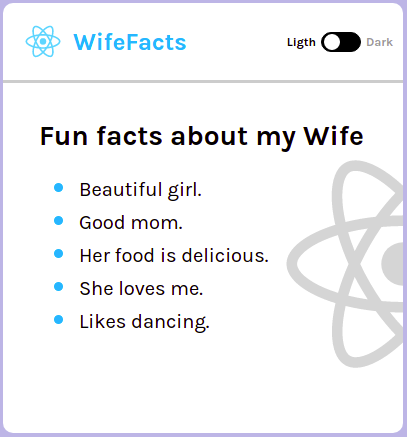
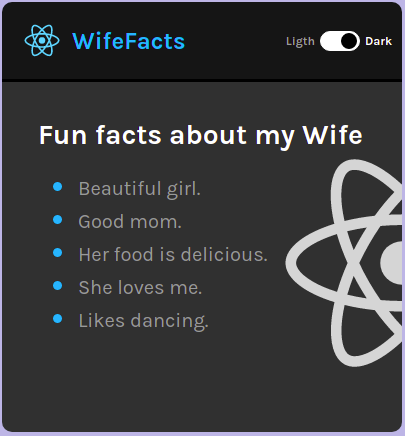

# Practice from Freecodecamp video 

[React Course Video](https://www.youtube.com/watch?v=bMknfKXIFA8).

## Card with dark mode switch

This project was bootstrapped with [Create React App](https://github.com/facebook/create-react-app).

## Available Scripts

In the project directory, you can run:

### `npm start`

Runs the app in the development mode.\
Open [http://localhost:3000](http://localhost:3000) to view it in your browser.

#### Personal note. 

The switch could be make in different ways.
